# Architecture

## System Overview

### Routing Overview

The application uses `react-router-dom` with two distinct route trees:

| Route | Component | Auth required? | Purpose |
|---|---|---|---|
| `/` | `HomePage.tsx` | No | Public landing page: trust signals, install commands, backup guidance, links to `/ledgers` |
| `/ledgers` | `LedgerEntryPage.tsx` | No | Ledger selector — entry point for the authenticated app |
| `/dashboard`, `/transactions`, `/budgets`, etc. | `Layout` (nested) | Yes (active ledger) | All authenticated modules: dashboard, transactions, budgets, reports, settings |

On Electron and Capacitor, the app uses `HashRouter` so native shells can boot directly into `/#/ledgers` without server-side route handling. The browser build uses `BrowserRouter`.

`HomePage.tsx` lives outside the authenticated `Layout` route so it never triggers the active-ledger redirect. It retains the language switcher and light/dark toggle but has its own header rather than the app sidebar.

---

### Web Application Architecture

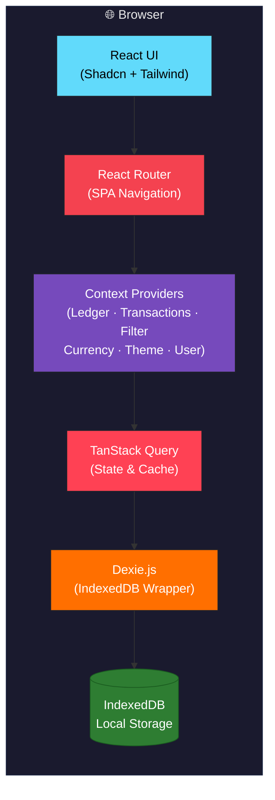

### Platform Build and Delivery

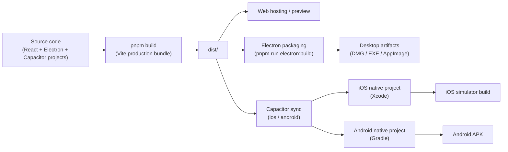

### Electron Desktop Architecture

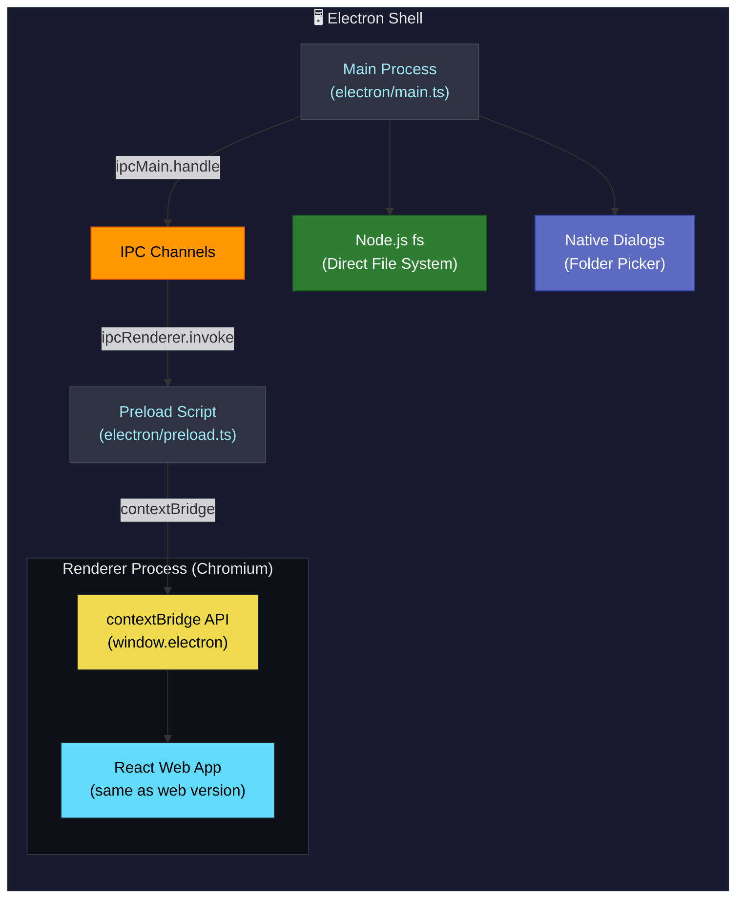

### Local API Architecture (Electron only)

The desktop app can expose an opt-in REST API on `127.0.0.1`. The data lives in the renderer's IndexedDB, so the main process owns only the socket and relays each request to the renderer, which runs it against the same data layer the UI uses. See [API.md](API.md) for the endpoint reference.

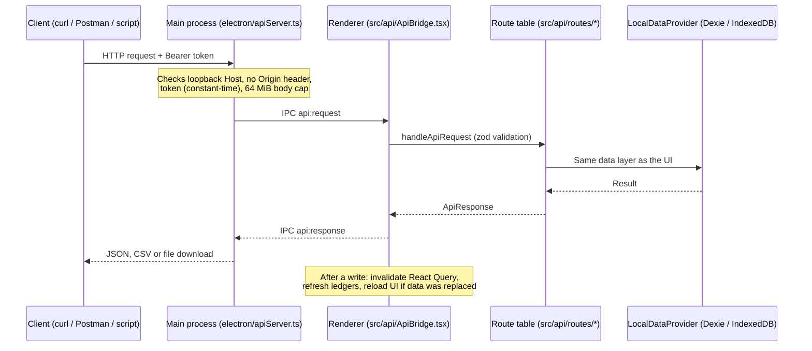

Key points:

- **Off by default.** The user turns it on in Settings, which stores the port and a generated token in `api-config.json` (mode `0600`) under the app data folder.
- **Loopback only, no browser access.** Requests carrying an `Origin` header are refused, so web pages cannot call it.
- **One route table.** `src/api/routes/index.ts` is the source of truth for the router, the generated `/openapi.json`, and the Postman coverage test.
- **Shared logic with the UI.** Renames, transfer detection, duplicate detection and AI categorization live in shared code (`src/api/entityOps.ts`, `src/utils/transactionMaintenance.ts`, `useAutoCategorize`) so the UI and the API behave the same.
- **Safe by default.** Secrets (AI keys, backup password hashes) are never returned. Deletions need `confirm_delete`, restores need `confirm_replace`, bulk operations support `dry_run`, and AI use is opt-in per request.
- **Not available on web or mobile**, which cannot host a local server.

### Native Mobile Architecture

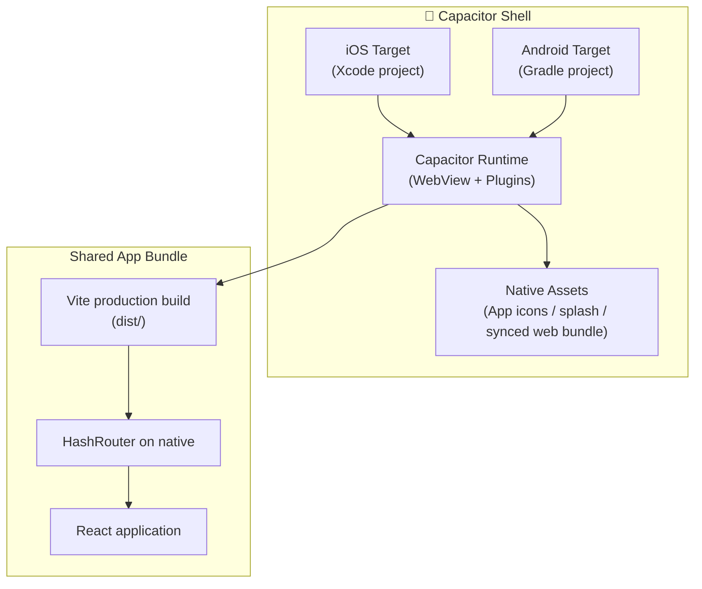

### iOS Runtime Architecture

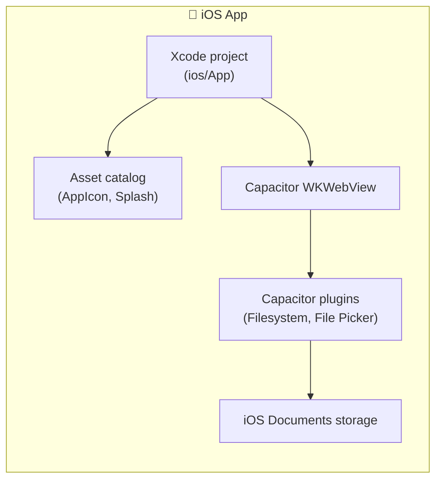

### Android Runtime Architecture

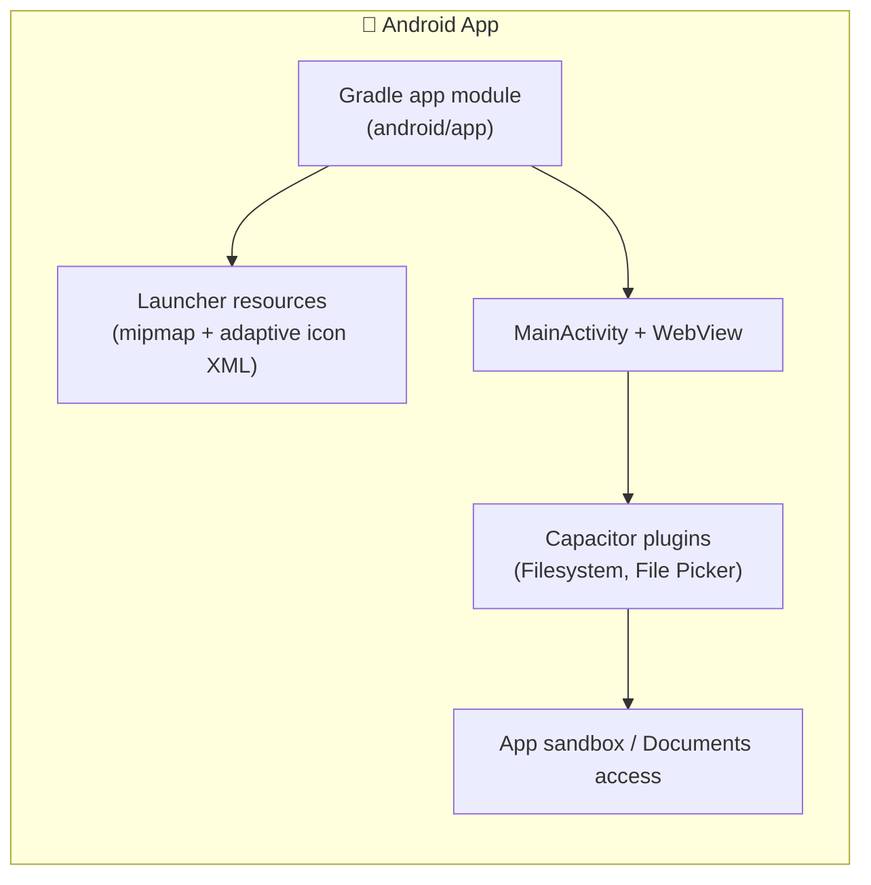

### Native Asset Refresh Flow

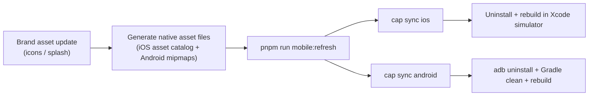

### File System Abstraction (Web, Electron, Capacitor Support)

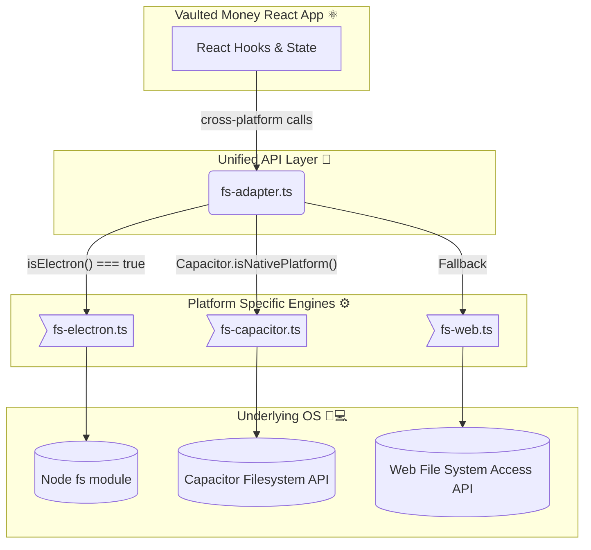

### Data Flow

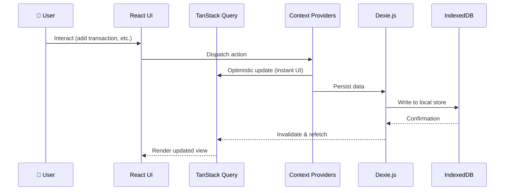

### AI Auto-Categorization Flow (BYOK)

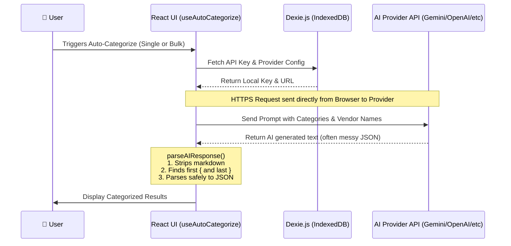

## Architectural Decisions
- [2026-10] [Opt-in local REST API served by the Electron main process]
    - **Context**: Users want to script the app, import and export data without the GUI, and build their own interfaces. All data lives in the renderer's IndexedDB, which the main process cannot read.
    - **Decision**: The main process hosts a loopback-only HTTP server and relays requests over IPC to the renderer, which executes them against the same data layer as the UI. It is off by default and protected by a bearer token.
    - **Consequences**:
        - **Pros**: No second data store to keep in sync. UI and API behave identically. Data never leaves the machine.
        - **Cons**: The app window must be running (the API answers `503 ui_not_ready` otherwise). Desktop only. The API is a public contract, so changes must update tests, docs and the Postman collection (see `documentation/CLAUDE.md`).
- [2024-03-XX] [Direct Browser-to-AI Provider Communication]
    - **Context**: We want users to be able to use AI features without creating a centralized backend that could store their API keys or financial data, maintaining the "local-first" privacy ethos.
    - **Decision**: Implemented BYOK (Bring Your Own Key) where the React app communicates directly with AI provider APIs (Gemini, Anthropic, Mistral, etc.).
    - **Consequences**:
        - **Pros**: Complete privacy for the user. No backend infrastructure required. Zero server costs.
        - **Cons**: Susceptible to CORS issues with certain providers if they don't allow browser requests, requiring users to sometimes handle configuration quirks.
- [2024-03-XX] [Robust client-side JSON parsing for AI outputs]
    - **Context**: Different AI models have wildly varying tendencies to wrap requested JSON in markdown or add conversational fluff ("Sure, here is your JSON:").
    - **Decision**: Added a central `parseAIResponse` utility that manually extracts substrings between `{` and `}` if standard `JSON.parse` fails.
    - **Consequences**: Reduces the rate of categorization failures significantly across different LLM providers without needing complex prompt engineering for every single model type.
- [Date] [Decision Title]
    - **Context**: [Why was this decision made?]
    - **Decision**: [What was decided?]
    - **Consequences**: [What are the pros/cons?]
